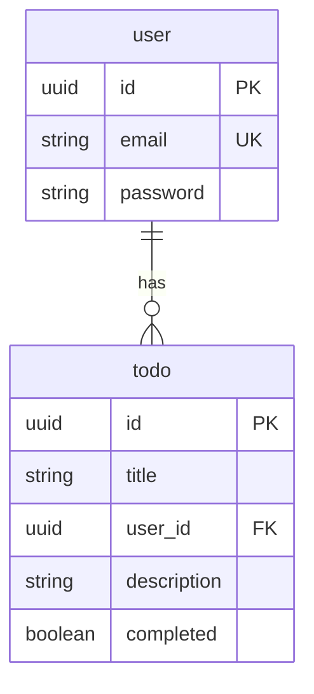

# Entity Relationship Diagram

User and Todo entities and their relationship.

## Diagram

- **User** (table `user`): Primary key `id` (UUID). Unique `email`. Required `password` (stored hashed).
- **Todo** (table `todo`): Primary key `id` (UUID). Foreign key `user_id` → `user.id`. Unique per user: constraint `UNIQUE_TITLE_USER` on `(title, user_id)`.
- **Relationship**: One user has many todos; deleting a user cascades to their todos.

## Source

Entity schemas: `libs/server/data-access-todo/src/lib/database/schemas/`  
- `user.entity-schema.ts`  
- `to-do.entity-schema.ts`
