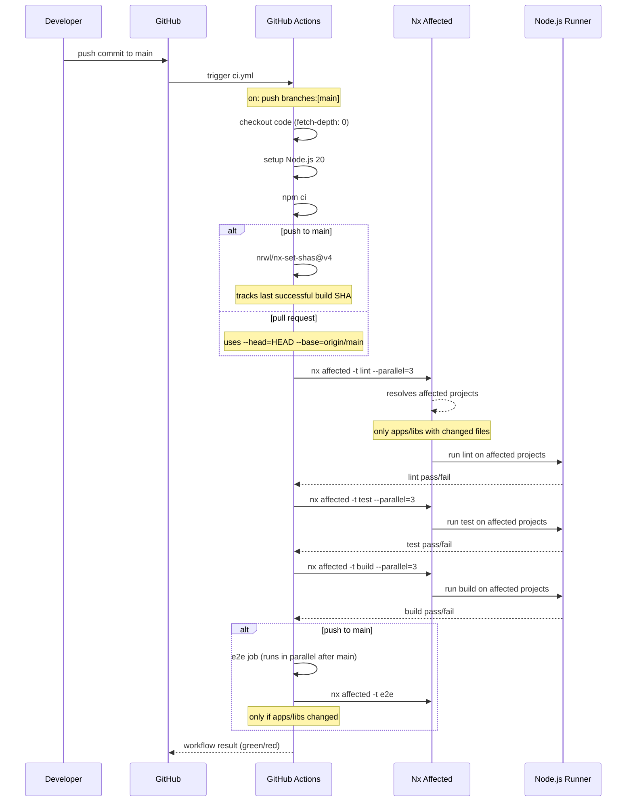
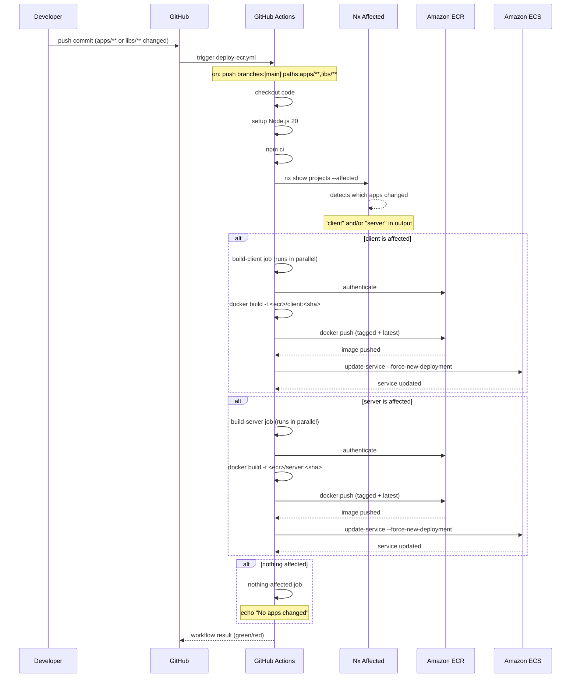
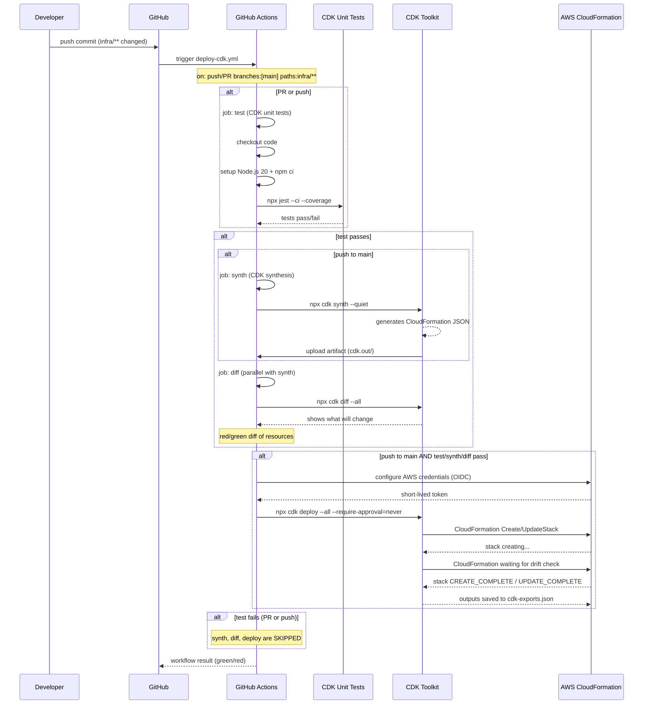
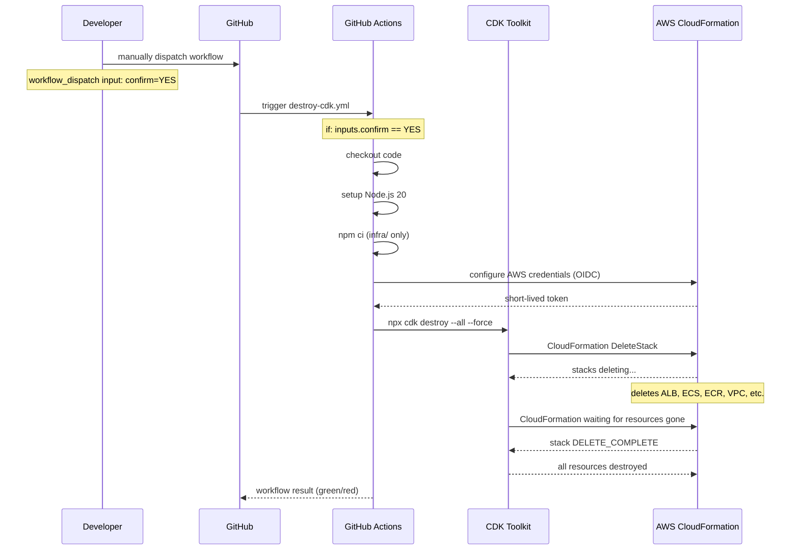
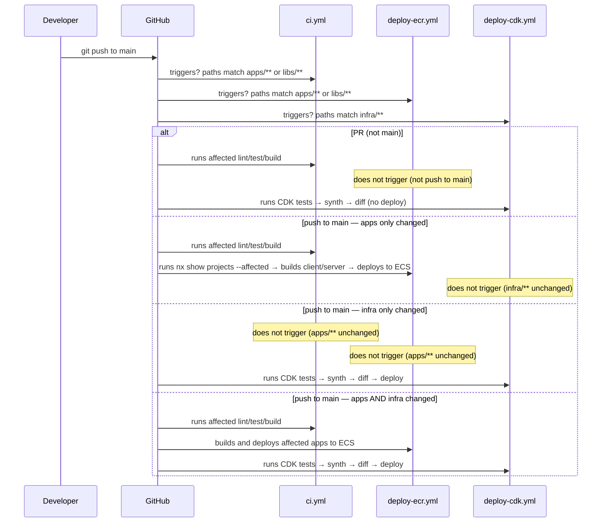

# AWS CDK + ECS Fargate Deployment Plan

> Full-stack Todo - Next.js 16 + NestJS 11 on Amazon ECS Fargate
> Created: 2026-05-07

---

## Table of Contents

1. [Overview](#overview)
2. [Architecture](#architecture)
3. [Prerequisites](#prerequisites)
4. [Project Structure](#project-structure)
5. [Phase 1 - AWS Account Setup](#phase-1---aws-account-setup)
6. [Phase 2 - CDK Infrastructure Project](#phase-2---cdk-infrastructure-project)
7. [Phase 3 - Dockerfiles](#phase-3---dockerfiles)
8. [Phase 4 - GitHub Actions Workflows](#phase-4---github-actions-workflows)
9. [Phase 5 - Deploy and Verify](#phase-5---deploy-and-verify)
10. [Environment Variables Reference](#environment-variables-reference)
11. [Cost Estimates](#cost-estimates)
12. [Operation Runbooks](#operation-runbooks)
13. [Troubleshooting](#troubleshooting)
14. [Next Steps - Route 53 and ACM](#next-steps---route-53-and-acm)

---

## Overview

This document describes a **zero-to-production** deployment strategy for the `full-stack-todo` Nx monorepo using:

| Layer | Technology |
|-------|-----------|
| **Infrastructure as Code** | AWS CDK v2 (TypeScript) |
| **Container Registry** | Amazon ECR (private) |
| **Compute** | AWS ECS on Fargate (serverless) |
| **Load Balancing** | Application Load Balancer |
| **CI/CD** | GitHub Actions |
| **Observability** | CloudWatch Container Insights + Logs |
| **DNS / TLS** | *Deferred to Route 53 and ACM (see Section 14)* |

### Design Decisions

| Decision | Choice | Rationale |
|----------|--------|-----------|
| Fargate vs EC2 | **Fargate** | No servers to manage; auto-scaling; pay-per-use |
| `awsvpc` mode | **Yes** | Required for Fargate; each task gets its own ENI |
| Pattern | **`ApplicationLoadBalancedFargateService`** | CDK L3 pattern that bundles ALB + TG + Service + TD |
| Two services | **Yes** | Separate service for `client` and `server` behind the same ALB, routed by path |
| ECR | **Private repository** | Public repos have limits; private is the default for production |
| GitHub OIDC | **Yes** | No long-lived IAM keys; short-lived tokens via `aws-actions/configure-aws-credentials@v4` |
| CDK in monorepo | **`infra/` sub-directory** | Keeps infra alongside apps; uses same npm workspace or separate package |

---

## Architecture

```
                         GitHub
              full-stack-todo repository
                    |               |
              push:main          push:main
                    |               |
           +--------+       +-------+--------+
           | build-ecr.yml  | deploy-cdk.yml |
           | (PR + push)    | (push to main) |
           +--------+       +-------+--------+
                    |               |
                    v               v
           +--------+       +-------+--------+
           | Build + Push |   | cdk deploy    |
           | to ECR       |   | (VPC/ECS/ECR/|
           |              |   |  ALB/Service) |
           +--------+       +-------+--------+
                    |               |
                    v               v
           +-------------------------------+
           |   ECS Cluster (Fargate)       |
           |                               |
           |   +-- Application Load Balancer   |
           |   |   /    -> client (Next.js)    |
           |   |   /api -> server (NestJS)     |
           |   +-------+-------+-------+       |
           |           |               |       |
           |   +-------v---+   +-------v-----+  |
           |   | client    |   | server      |  |
           |   | Service   |   | Service     |  |
           |   | Fargate   |   | Fargate     |  |
           |   | 512 CPU   |   | 1024 CPU    |  |
           |   | 1024 MB   |   | 2048 MB     |  |
           |   +-----------+   +-------------+  |
           +-------------------------------+
                    |
                    v
           +-----------------+
           |  RDS (PostgreSQL)|  <-- Deferred (see Section 14)
           +-----------------+
```

---

## Prerequisites

Before starting, ensure you have:

| # | Item | Status |
|---|------|--------|
| 1 | AWS Account with billing configured | You have this |
| 2 | GitHub account and repository pushed | TODO |
| 3 | AWS CLI installed (`aws --version`) | TODO |
| 4 | Node.js 20+ (LTS) | Workspace uses Node LTS |
| 5 | npm 10+ | Workspace uses npm |
| 6 | Docker Desktop or Docker Engine | TODO |
| 7 | AWS CDK CLI (`npm i -g aws-cdk`) | TODO |
| 8 | Bootstrap CDK in your account | TODO |
| 9 | IAM credentials once for bootstrap, then OIDC | TODO |

### Initial AWS Bootstrap (one-time, via CLI)

```bash
# 1. Configure AWS CLI (first time only)
aws configure
# Enter: Access Key ID, Secret Access Key, region (us-east-1), output format (json)

# 2. Bootstrap CDK in your account (one-time)
cdk bootstrap aws://$(aws sts get-caller-identity --query Account --output text)/us-east-1

# 3. Verify CDK works
cdk --version
```

---

## Project Structure

```
full-stack-todo/
+-- infra/                          NEW: CDK infrastructure project
|   +-- bin/
|   |   +-- app.ts                  Root CDK app
|   +-- lib/
|   |   +-- stacks/
|   |   |   +-- vpc-stack.ts        VPC, subnets, NAT
|   |   |   +-- ecr-stack.ts        ECR repositories
|   |   |   +-- ecs-cluster-stack.ts ECS Cluster
|   |   |   +-- client-service-stack.ts  Client ECS Service
|   |   |   +-- server-service-stack.ts  Server ECS Service
|   |   +-- constants.ts            Shared config
|   +-- test/unit/
|   |   +-- stacks.test.ts
|   +-- cdk.json
|   +-- jest.config.ts
|   +-- package.json
|   +-- tsconfig.json
|   +-- .gitignore
+-- apps/
|   +-- client/
|   |   +-- Dockerfile              NEW
|   +-- server/
|   |   +-- Dockerfile              NEW
+-- .github/
|   +-- workflows/
|       +-- build-ecr.yml            NEW: build and push Docker images
|       +-- deploy-cdk.yml           NEW: CDK deploy on push to main
|       +-- destroy-cdk.yml          NEW: teardown dev environment
+-- apps/
+-- libs/
+-- nx.json
+-- package.json
+-- docs/project/
    +-- aws-cdk-ecs-deployment.md   This file
```

---

## Phase 1 - AWS Account Setup

### 1.1 Create IAM User for Bootstrap

This IAM user is only needed for the first bootstrap. After that, GitHub Actions uses OIDC.

```bash
# Create IAM user
aws iam create-user --user-name cdk-deployer

# Create least-privilege policy
cat > /tmp/cdk-policy.json << 'POLICYEOF'
{
  "Version": "2012-10-17",
  "Statement": [
    {
      "Effect": "Allow",
      "Action": [
        "ecr:GetAuthorizationToken",
        "ecr:InitiateLayerUpload",
        "ecr:UploadLayerPart",
        "ecr:CompleteLayerUpload",
        "ecr:PutImage",
        "ecr:CreateRepository",
        "ecr:BatchCheckLayerAvailability",
        "ecr:GetDownloadUrlForLayer",
        "ecr:BatchGetImage",
        "ecs:RegisterTaskDefinition",
        "ecs:DescribeTaskDefinition",
        "ecs:CreateService",
        "ecs:UpdateService",
        "ecs:DescribeServices",
        "ecs:DescribeClusters",
        "ecs:DeleteService",
        "ecs:SubmitContainerStateChange",
        "ec2:DescribeVpcs",
        "ec2:DescribeSubnets",
        "ec2:DescribeSecurityGroups",
        "ec2:DescribeInstances",
        "ec2:DescribeNetworkInterfaces",
        "ec2:CreateNetworkInterface",
        "ec2:DeleteNetworkInterface",
        "ec2:ModifyNetworkInterfaceAttribute",
        "ec2:AttachNetworkInterface",
        "cloudwatch:PutMetricData",
        "logs:CreateLogGroup",
        "logs:CreateLogStream",
        "logs:PutLogEvents",
        "logs:DescribeLogStreams",
        "ssm:GetParameter",
        "kms:Decrypt",
        "sts:GetCallerIdentity",
        "s3:GetObject",
        "s3:PutObject"
      ],
      "Resource": "*"
    },
    {
      "Effect": "Allow",
      "Action": [
        "iam:CreateServiceLinkedRole",
        "iam:AttachRolePolicy"
      ],
      "Resource": "arn:aws:iam::*:role/aws-service-role/elasticloadbalancing.amazonaws.com/AWSServiceRoleForElasticLoadBalancing"
    },
    {
      "Effect": "Allow",
      "Action": [
        "elasticloadbalancing:CreateListener",
        "elasticloadbalancing:DeleteListener",
        "elasticloadbalancing:CreateTargetGroup",
        "elasticloadbalancing:DeleteTargetGroup",
        "elasticloadbalancing:ModifyTargetGroup",
        "elasticloadbalancing:RegisterTargets",
        "elasticloadbalancing:DeregisterTargets",
        "elasticloadbalancing:CreateLoadBalancer",
        "elasticloadbalancing:DeleteLoadBalancer",
        "elasticloadbalancing:ModifyLoadBalancerAttributes"
      ],
      "Resource": "*"
    }
  ]
}
POLICYEOF

aws iam create-policy --policy-name CDKDeployPolicy --policy-document file:///tmp/cdk-policy.json

# Replace 123456789012 with your actual account ID
aws iam attach-user-policy \
  --user-name cdk-deployer \
  --policy-arn arn:aws:iam::123456789012:policy/CDKDeployPolicy

# Create access keys (save securely - used for bootstrap only)
aws iam create-access-key --user-name cdk-deployer
# Save the AccessKeyId and SecretAccessKey output
```

### 1.2 Bootstrap CDK

```bash
export AWS_ACCESS_KEY_ID=<your-access-key-id>
export AWS_SECRET_ACCESS_KEY=<your-secret-access-key>

cdk bootstrap aws://123456789012/us-east-1
```

This creates the `CDKToolkit` stack (S3 bucket for asset storage), IAM roles for CDK deployments, and ECR repositories for CDK asset buckets.

### 1.3 Create GitHub OIDC Identity Provider (one-time)

```bash
# Create OIDC provider for GitHub Actions
aws iam create-open-id-connect-provider \
  --url https://token.actions.githubusercontent.com \
  --client-id-list sts.amazonaws.com \
  --thumbprint-list a031c46782e6e6c662c2c87c76da9aa62ccabd8e

# Create trust policy document
cat > /tmp/trust-policy.json << 'TRUSTEOF'
{
  "Version": "2012-10-17",
  "Statement": [
    {
      "Effect": "Allow",
      "Principal": {
        "Federated": "arn:aws:iam::123456789012:github-actions/your-org"
      },
      "Action": "sts:AssumeRoleWithWebIdentity",
      "Condition": {
        "StringEquals": {
          "token.actions.githubusercontent.com:aud": "sts.amazonaws.com"
        },
        "StringLike": {
          "token.actions.githubusercontent.com:sub": "repo:your-org/full-stack-todo:ref:refs/heads/main"
        }
      }
    }
  ]
}
TRUSTEOF

# Create the deployment role
aws iam create-role \
  --role-name GitHubActionsCDKDeployRole \
  --assume-role-policy-document file:///tmp/trust-policy.json

# Attach the same policy
aws iam attach-role-policy \
  --role-name GitHubActionsCDKDeployRole \
  --policy-arn arn:aws:iam::123456789012:policy/CDKDeployPolicy
```

> **Replace** `your-org` with your actual GitHub org or username, and `123456789012` with your AWS account ID.

### 1.4 Configure GitHub Secrets

In your GitHub repository, go to Settings Secrets and variables Actions and add:

| Secret Name | Value |
|-------------|-------|
| `AWS_ROLE_ARN` | `arn:aws:iam::123456789012:role/GitHubActionsCDKDeployRole` |
| `AWS_DEFAULT_REGION` | `us-east-1` |
| `ECR_REPOSITORY_CLIENT` | `full-stack-todo/client` |
| `ECR_REPOSITORY_SERVER` | `full-stack-todo/server` |
| `ECS_CLUSTER_NAME` | `full-stack-todo-cluster` |
| `ECS_CLIENT_SERVICE_NAME` | `full-stack-todo-cluster-ClientService` |
| `ECS_SERVER_SERVICE_NAME` | `full-stack-todo-cluster-ServerService` |

---

## Phase 2 - CDK Infrastructure Project

### 2.1 Scaffold the CDK Project

```bash
cd full-stack-todo

# Create the infra directory structure
mkdir -p infra/bin infra/lib/stacks infra/test/unit

cd infra

# Create package.json
cat > package.json << 'PKGEOF'
{
  "name": "full-stack-todo-infra",
  "version": "0.1.0",
  "type": "module",
  "scripts": {
    "build": "tsc",
    "synth": "tsx bin/app.ts",
    "synth:nop": "tsx bin/app.ts --all --context autoReplaceStackNames=OFF",
    "test": "jest --passWithNoTests --silent",
    "cdk": "cdk",
    "diff": "tsx bin/app.ts && cdk diff --all",
    "deploy:dev": "tsx bin/app.ts --all --require-approval=never"
  },
  "dependencies": {
    "aws-cdk-lib": "^2.185.0",
    "constructs": "^10.4.2"
  },
  "devDependencies": {
    "@types/jest": "^30.0.0",
    "@types/node": "^20.19.9",
    "aws-cdk": "^2.1000.0",
    "cdk-nag": "^2.36.0",
    "jest": "^30.0.2",
    "ts-jest": "^29.4.0",
    "ts-node": "^10.9.2",
    "tsx": "^4.20.3",
    "typescript": "~5.9.2"
  }
}
PKGEOF

npm install
```

### 2.2 CDK Configuration Files

**infra/cdk.json**

```json
{
  "app": "npx tsx bin/app.ts",
  "context": {
    "@aws-cdk/aws-apigateway:usagePlanKeyOrderInsensitiveId": true,
    "@aws-cdk/core:stackRelativeExports": true,
    "@aws-cdk/aws-rds:lowercaseDbIdentifier": true,
    "@aws-cdk/aws-lambda:recognizeVersionProps": true,
    "@aws-cdk/aws-ecs:arnFormatIncludesClusterName": true
  }
}
```

**infra/tsconfig.json**

```json
{
  "compilerOptions": {
    "target": "ES2022",
    "module": "esnext",
    "lib": ["ES2022"],
    "outDir": "dist",
    "declaration": true,
    "strict": true,
    "noImplicitAny": true,
    "strictNullChecks": true,
    "noImplicitThis": true,
    "alwaysStrict": true,
    "noUnusedLocals": false,
    "noUnusedParameters": false,
    "noImplicitReturns": true,
    "inlineSourceMap": true,
    "inlineSources": true,
    "experimentalDecorators": true,
    "strictPropertyInitialization": false,
    "skipLibCheck": true,
    "moduleResolution": "bundler",
    "resolveJsonModule": true
  },
  "include": ["bin/**/*.ts", "lib/**/*.ts"],
  "exclude": ["node_modules", "dist", "test"]
}
```

**infra/.gitignore**

```
node_modules/
dist/
cdk-exports.json
*.log
```

### 2.3 Shared Configuration

**infra/lib/constants.ts**

```typescript
export const InfraConfig = {
  account: process.env.CDK_DEFAULT_ACCOUNT || '123456789012',
  region: process.env.CDK_DEFAULT_REGION || 'us-east-1',
  serviceName: 'full-stack-todo',

  // Client (Next.js)
  clientCpu: 512,
  clientMemoryLimitMiB: 1024,
  clientDesiredCount: 2,

  // Server (NestJS)
  serverCpu: 1024,
  serverMemoryLimitMiB: 2048,
  serverDesiredCount: 2,

  // ALB
  albHealthCheckPathClient: '/',
  albHealthCheckPathServer: '/api/health',
} as const;
```

### 2.4 CDK App Entry Point

**infra/bin/app.ts**

```typescript
#!/usr/bin/env node
import 'source-map-support/register';
import * as cdk from 'aws-cdk-lib';
import { App } from 'aws-cdk-lib';
import { VpcStack } from '../lib/stacks/vpc-stack';
import { EcrStack } from '../lib/stacks/ecr-stack';
import { EcsClusterStack } from '../lib/stacks/ecs-cluster-stack';
import { ClientServiceStack } from '../lib/stacks/client-service-stack';
import { ServerServiceStack } from '../lib/stacks/server-service-stack';
import { InfraConfig } from '../lib/constants';

const app = new App();

const env = {
  account: InfraConfig.account,
  region: InfraConfig.region,
};

const vpc = new VpcStack(app, 'VpcStack', { env });
const ecr = new EcrStack(app, 'EcrStack', { env });
const cluster = new EcsClusterStack(app, 'EcsClusterStack', { env, vpc });

new ClientServiceStack(app, 'ClientServiceStack', {
  env,
  vpc,
  cluster,
  ecrRepository: ecr.clientRepository,
});

new ServerServiceStack(app, 'ServerServiceStack', {
  env,
  vpc,
  cluster,
  ecrRepository: ecr.serverRepository,
});
```

### 2.5 VPC Stack

**infra/lib/stacks/vpc-stack.ts**

```typescript
import * as cdk from 'aws-cdk-lib';
import { Stack, StackProps } from 'aws-cdk-lib';
import { Construct } from 'constructs';

export interface VpcStackProps extends StackProps {}

export class VpcStack extends Stack {
  public readonly vpc: cdk.aws_ec2.Vpc;

  constructor(scope: Construct, id: string, props: VpcStackProps) {
    super(scope, id, props);

    this.vpc = new cdk.aws_ec2.Vpc(this, 'AppVpc', {
      maxAzs: 3,
      natGateways: 1,
      subnetConfiguration: [
        {
          cidrMask: 24,
          name: 'Public',
          subnetType: cdk.aws_ec2.SubnetType.PUBLIC,
        },
        {
          cidrMask: 24,
          name: 'Private',
          subnetType: cdk.aws_ec2.SubnetType.PRIVATE_WITH_EGRESS,
        },
      ],
    });
  }
}
```

### 2.6 ECR Stack

**infra/lib/stacks/ecr-stack.ts**

```typescript
import * as cdk from 'aws-cdk-lib';
import { Repository } from 'aws-cdk-lib/aws-ecr';
import { Stack, StackProps } from 'aws-cdk-lib';
import { Construct } from 'constructs';

export interface EcrStackProps extends StackProps {}

export class EcrStack extends Stack {
  public readonly clientRepository: Repository;
  public readonly serverRepository: Repository;

  constructor(scope: Construct, id: string, props: EcrStackProps) {
    super(scope, id, props);

    this.clientRepository = new Repository(this, 'ClientRepository', {
      repositoryName: 'full-stack-todo/client',
      imageScanOnPush: true,
      removalPolicy: cdk.RemovalPolicy.RETAIN,
    });

    this.serverRepository = new Repository(this, 'ServerRepository', {
      repositoryName: 'full-stack-todo/server',
      imageScanOnPush: true,
      removalPolicy: cdk.RemovalPolicy.RETAIN,
    });
  }
}
```

### 2.7 ECS Cluster Stack

**infra/lib/stacks/ecs-cluster-stack.ts**

```typescript
import * as cdk from 'aws-cdk-lib';
import * as ecs from 'aws-cdk-lib/aws-ecs';
import { Stack, StackProps } from 'aws-cdk-lib';
import { Construct } from 'constructs';

export interface EcsClusterStackProps extends StackProps {
  readonly vpc: cdk.aws_ec2.Vpc;
}

export class EcsClusterStack extends Stack {
  public readonly cluster: ecs.Cluster;

  constructor(scope: Construct, id: string, props: EcsClusterStackProps) {
    super(scope, id, props);

    this.cluster = new ecs.Cluster(this, 'EcsCluster', {
      clusterName: 'full-stack-todo-cluster',
      vpc: props.vpc,
      enableFargateCapacityProviders: true,
    });
  }
}
```

### 2.8 Client Service Stack

**infra/lib/stacks/client-service-stack.ts**

```typescript
import * as cdk from 'aws-cdk-lib';
import * as ecs from 'aws-cdk-lib/aws-ecs';
import * as ecsPatterns from 'aws-cdk-lib/aws-ecs-patterns';
import { IRepository } from 'aws-cdk-lib/aws-ecr';
import { Stack, StackProps } from 'aws-cdk-lib';
import { Construct } from 'constructs';
import { InfraConfig } from '../constants';

export interface ClientServiceStackProps extends StackProps {
  readonly vpc: cdk.aws_ec2.Vpc;
  readonly cluster: ecs.Cluster;
  readonly ecrRepository: IRepository;
}

export class ClientServiceStack extends Stack {
  public readonly service: ecsPatterns.ApplicationLoadBalancedFargateService;

  constructor(scope: Construct, id: string, props: ClientServiceStackProps) {
    super(scope, id, props);

    this.service = new ecsPatterns.ApplicationLoadBalancedFargateService(this, 'Service', {
      cluster: props.cluster,
      memoryLimitMiB: InfraConfig.clientMemoryLimitMiB,
      cpu: InfraConfig.clientCpu,
      desiredCount: InfraConfig.clientDesiredCount,
      taskImageOptions: {
        image: ecs.ContainerImage.fromEcrRepository(props.ecrRepository, 'latest'),
        containerPort: 3000,
        environment: {
          NODE_ENV: 'production',
        },
      },
      publicService: true,
      healthCheckGracePeriod: cdk.Duration.seconds(60),
      listenerLogging: true,
    });

    // ALB path-based routing: client serves at /
    this.service.service.loadBalancer.insertTargets('/path-/ClientService', {
      port: 3000,
      targets: [this.service.service],
    });

    // Tag for cost allocation
    cdk.Tags.of(this.service.service).add('Service', 'client');
  }
}
```

### 2.9 Server Service Stack

**infra/lib/stacks/server-service-stack.ts**

```typescript
import * as cdk from 'aws-cdk-lib';
import * as ecs from 'aws-cdk-lib/aws-ecs';
import * as ecsPatterns from 'aws-cdk-lib/aws-ecs-patterns';
import { IRepository } from 'aws-cdk-lib/aws-ecr';
import { Stack, StackProps } from 'aws-cdk-lib';
import { Construct } from 'constructs';
import { InfraConfig } from '../constants';

export interface ServerServiceStackProps extends StackProps {
  readonly vpc: cdk.aws_ec2.Vpc;
  readonly cluster: ecs.Cluster;
  readonly ecrRepository: IRepository;
}

export class ServerServiceStack extends Stack {
  public readonly service: ecsPatterns.ApplicationLoadBalancedFargateService;

  constructor(scope: Construct, id: string, props: ServerServiceStackProps) {
    super(scope, id, props);

    this.service = new ecsPatterns.ApplicationLoadBalancedFargateService(this, 'Service', {
      cluster: props.cluster,
      memoryLimitMiB: InfraConfig.serverMemoryLimitMiB,
      cpu: InfraConfig.serverCpu,
      desiredCount: InfraConfig.serverDesiredCount,
      taskImageOptions: {
        image: ecs.ContainerImage.fromEcrRepository(props.ecrRepository, 'latest'),
        containerPort: 3000,
        environment: {
          NODE_ENV: 'production',
        },
      },
      publicService: true,
      healthCheckGracePeriod: cdk.Duration.seconds(60),
      listenerLogging: true,
    });

    // Tag for cost allocation
    cdk.Tags.of(this.service.service).add('Service', 'server');
  }
}
```

### 2.10 CDK Testing

**infra/jest.config.ts**

```typescript
export default {
  testEnvironment: 'node',
  roots: ['<rootDir>/test'],
  testMatch: ['**/*.test.ts'],
  transform: {
    '^.+\\.tsx?$': 'ts-jest',
  },
};
```

**infra/test/unit/stacks.test.ts**

```typescript
import * as cdk from 'aws-cdk-lib';
import { Template } from 'aws-cdk-lib/assertions';
import { VpcStack } from '../../lib/stacks/vpc-stack';
import { EcsClusterStack } from '../../lib/stacks/ecs-cluster-stack';

describe('VPC Stack', () => {
  test('creates a VPC with 2 subnet types across 3 AZs', () => {
    const app = new cdk.App();
    const stack = new VpcStack(app, 'TestVpc');
    const template = Template.fromStack(stack);

    template.resourceCountIs('AWS::EC2::VPC', 1);
    template.resourceCountIs('AWS::EC2::Subnet', 6); // 3 public + 3 private
    template.resourceCountIs('AWS::EC2::NatGateway', 1);
  });
});

describe('ECS Cluster Stack', () => {
  test('creates an ECS cluster with Fargate capacity providers', () => {
    const app = new cdk.App();
    const vpcStack = new VpcStack(app, 'TestVpc');
    const stack = new EcsClusterStack(app, 'TestEcs', {
      env: { account: '123456789012', region: 'us-east-1' },
      vpc: vpcStack.vpc,
    });
    const template = Template.fromStack(stack);

    template.resourceCountIs('AWS::ECS::Cluster', 1);
  });
});
```

---

## Phase 3 - Dockerfiles

The Nx workspace uses `@nx/next:build` and `webpack-cli build`. We create multi-stage Dockerfiles for each app.

### Client Dockerfile (Next.js)

**apps/client/Dockerfile**

```dockerfile
# ---- Build stage ----
FROM node:20-alpine AS builder

WORKDIR /app

# Copy root package files for workspace dependencies
COPY package.json package-lock.json ./
COPY libs/ ./libs/

# Install all dependencies (workspace-wide)
RUN npm ci

# Copy client app source
COPY apps/client/ ./apps/client/
COPY tsconfig.*.json ./

# Build client
RUN npx nx build client --production

# ---- Production stage ----
FROM node:20-alpine AS runner

WORKDIR /app

ENV NODE_ENV=production

# Copy only the built Next.js output
COPY --from=builder /app/apps/client/.next/ .next/
COPY --from=builder /app/apps/client/package.json ./

# Install production-only dependencies
RUN npm ci --omit=dev

EXPOSE 3000

ENV PORT=3000
ENV HOSTNAME="0.0.0.0"

CMD ["node", "node_modules/.bin/next", "start", "-p", "3000"]
```

### Server Dockerfile (NestJS)

**apps/server/Dockerfile**

```dockerfile
# ---- Build stage ----
FROM node:20-alpine AS builder

WORKDIR /app

# Copy root package files for workspace dependencies
COPY package.json package-lock.json ./
COPY libs/ ./libs/

# Install all dependencies (workspace-wide)
RUN npm ci

# Copy server app source
COPY apps/server/ ./apps/server/
COPY tsconfig.*.json ./

# Build server with webpack
RUN npx nx build server --production

# ---- Production stage ----
FROM node:20-alpine AS runner

WORKDIR /app

ENV NODE_ENV=production

# Copy built output
COPY --from=builder /app/apps/server/dist/ ./dist/
COPY --from=builder /app/apps/server/package.json ./

# Install production-only dependencies
RUN npm ci --omit=dev

EXPOSE 3000

CMD ["node", "dist/main.js"]
```

### .dockerignore files

**apps/client/.dockerignore**

```
node_modules
.next
dist
.env
.env.*
*.log
.git
```

**apps/server/.dockerignore**

```
node_modules
dist
.env
.env.*
*.log
.git
```

---

## Phase 4 - GitHub Actions Workflows

### 4.0 How `nx affected` Works

Nx's `affected` command identifies which projects have changed based on a base branch comparison, then runs tasks only on those projects. The workflow:

1. Compares the current commit against `origin/main` (or the base branch)
2. Uses the Nx project graph to find which projects depend on changed files
3. Runs only `lint`, `test`, and `build` on that affected subset

This means if you only change `libs/server/feature-todo`, only `server` will be linted, tested, built, and deployed — never the `client`.

**Key flags:**
- `--base=origin/main` — branch to compare against
- `--head=HEAD` — current commit
- `--parallel` — run tasks in parallel
- `--exclude` — skip certain projects

For PRs use `--head=HEAD --base=origin/main`. For main branch pushes, use the `nrwl/nx-set-shas@v4` action to track the last successful build.

### 4.1 CI: Affected Lint, Test, and Build

This workflow runs on **every PR and every push to main**. It runs only affected lint, test, and build targets using `nx affected`.

**.github/workflows/ci.yml**

```yaml
name: CI

on:
  push:
    branches: [main]
  pull_request:
    branches: [main]

permissions:
  contents: read

jobs:
  main:
    name: Affected CI
    runs-on: ubuntu-latest
    steps:
      - name: Checkout code
        uses: actions/checkout@v4
        with:
          fetch-depth: 0

      - name: Setup Node.js
        uses: actions/setup-node@v4
        with:
          node-version: 20
          cache: npm

      - name: Install dependencies
        run: npm ci

      - name: Derive SHAs for affected commands
        if: github.event_name == 'push'
        uses: nrwl/nx-set-shas@v4
        with:
          main-branch-name: 'main'

      # ---- Lint: only affected projects ----
      - name: Run affected lint
        run: npx nx affected -t lint --parallel=3 --exclude="infra"

      # ---- Test: only affected projects ----
      - name: Run affected test
        run: npx nx affected -t test --parallel=3 --exclude="infra"

      # ---- Build: only affected projects ----
      - name: Run affected build
        run: npx nx affected -t build --parallel=3 --exclude="infra"

  # ---- E2E: depends on all apps being built ----
  e2e:
    name: Affected E2E
    runs-on: ubuntu-latest
    needs: main
    if: github.event_name == 'push'
    steps:
      - name: Checkout code
        uses: actions/checkout@v4
        with:
          fetch-depth: 0

      - name: Setup Node.js
        uses: actions/setup-node@v4
        with:
          node-version: 20
          cache: npm

      - name: Install dependencies
        run: npm ci

      - name: Derive SHAs for affected commands
        uses: nrwl/nx-set-shas@v4
        with:
          main-branch-name: 'main'

      - name: Run affected e2e
        run: npx nx affected -t e2e --parallel=1
```

**What runs in practice:**

| You change | Affected jobs |
|------------|---------------|
| `apps/client/` | lint client → test client → build client |
| `apps/server/` | lint server → test server → build server |
| `libs/server/feature-todo/` | lint server → test server → build server |
| `libs/client/` (shared UI) | lint client → test client → build client |
| `apps/server/` AND `apps/client/` | lint client + server → test client + server → build client + server |
| `infra/` only | nothing runs (excluded from affected CI) |

### 4.2 Deploy to ECR: Only Affected Apps

This workflow builds and pushes Docker images to ECR for **only the apps that changed**. It uses `nx affected --base=origin/main --head=HEAD --target=build` to determine which apps need rebuilding, then pushes only those images.

**.github/workflows/deploy-ecr.yml**

```yaml
name: Deploy Affected Apps to ECR

on:
  push:
    branches: [main]
    paths:
      - 'apps/**'
      - 'libs/**'

permissions:
  id-token: write
  contents: read

env:
  AWS_REGION: ${{ vars.AWS_DEFAULT_REGION || 'us-east-1' }}
  ECR_REPOSITORY_CLIENT: ${{ vars.ECR_REPOSITORY_CLIENT }}
  ECR_REPOSITORY_SERVER: ${{ vars.ECR_REPOSITORY_SERVER }}

jobs:
  # Determine which apps are affected
  list-affected:
    name: List Affected Apps
    runs-on: ubuntu-latest
    outputs:
      client: ${{ steps.affected.outputs.client }}
      server: ${{ steps.affected.outputs.server }}
    steps:
      - name: Checkout code
        uses: actions/checkout@v4
        with:
          fetch-depth: 0

      - name: Setup Node.js
        uses: actions/setup-node@v4
        with:
          node-version: 20
          cache: npm

      - name: Install dependencies
        run: npm ci

      - name: Detect affected apps
        id: affected
        run: |
          # Get affected apps using nx affected
          AFFECTED_APPS=$(npx nx show projects --affected)

          echo "Affected apps: $AFFECTED_APPS"

          if echo "$AFFECTED_APPS" | grep -q "^client$"; then
            echo "client=true" >> $GITHUB_OUTPUT
          else
            echo "client=false" >> $GITHUB_OUTPUT
          fi

          if echo "$AFFECTED_APPS" | grep -q "^server$"; then
            echo "server=true" >> $GITHUB_OUTPUT
          else
            echo "server=false" >> $GITHUB_OUTPUT
          fi

  # Build and push client if affected
  build-client:
    name: Build and Push Client
    needs: list-affected
    if: needs.list-affected.outputs.client == 'true'
    runs-on: ubuntu-latest
    steps:
      - name: Checkout code
        uses: actions/checkout@v4

      - name: Configure AWS credentials
        uses: aws-actions/configure-aws-credentials@v4
        with:
          role-to-assume: ${{ secrets.AWS_ROLE_ARN }}
          aws-region: ${{ env.AWS_REGION }}

      - name: Login to Amazon ECR
        id: ecr-login-client
        uses: aws-actions/amazon-ecr-login@v2

      - name: Build and push Docker image
        working-directory: apps/client
        run: |
          IMAGE_URI="${{ steps.ecr-login-client.outputs.registry }}/${{ env.ECR_REPOSITORY_CLIENT }}:${{ github.sha }}"
          docker build -t "$IMAGE_URI" -t "${{ steps.ecr-login-client.outputs.registry }}/${{ env.ECR_REPOSITORY_CLIENT }}:latest" .
          docker push "$IMAGE_URI"
          docker push "${{ steps.ecr-login-client.outputs.registry }}/${{ env.ECR_REPOSITORY_CLIENT }}:latest"
          echo "image_uri=$IMAGE_URI" >> $GITHUB_OUTPUT

      - name: Deploy to ECS
        if: success()
        run: |
          aws ecs update-service \
            --cluster ${{ vars.ECS_CLUSTER_NAME }} \
            --service ${{ vars.ECS_CLIENT_SERVICE_NAME }} \
            --force-new-deployment \
            --region ${{ env.AWS_REGION }}

  # Build and push server if affected
  build-server:
    name: Build and Push Server
    needs: list-affected
    if: needs.list-affected.outputs.server == 'true'
    runs-on: ubuntu-latest
    steps:
      - name: Checkout code
        uses: actions/checkout@v4

      - name: Configure AWS credentials
        uses: aws-actions/configure-aws-credentials@v4
        with:
          role-to-assume: ${{ secrets.AWS_ROLE_ARN }}
          aws-region: ${{ env.AWS_REGION }}

      - name: Login to Amazon ECR
        id: ecr-login-server
        uses: aws-actions/amazon-ecr-login@v2

      - name: Build and push Docker image
        working-directory: apps/server
        run: |
          IMAGE_URI="${{ steps.ecr-login-server.outputs.registry }}/${{ env.ECR_REPOSITORY_SERVER }}:${{ github.sha }}"
          docker build -t "$IMAGE_URI" -t "${{ steps.ecr-login-server.outputs.registry }}/${{ env.ECR_REPOSITORY_SERVER }}:latest" .
          docker push "$IMAGE_URI"
          docker push "${{ steps.ecr-login-server.outputs.registry }}/${{ env.ECR_REPOSITORY_SERVER }}:latest"
          echo "image_uri=$IMAGE_URI" >> $GITHUB_OUTPUT

      - name: Deploy to ECS
        if: success()
        run: |
          aws ecs update-service \
            --cluster ${{ vars.ECS_CLUSTER_NAME }} \
            --service ${{ vars.ECS_SERVER_SERVICE_NAME }} \
            --force-new-deployment \
            --region ${{ env.AWS_REGION }}

  # Notify if nothing was affected
  nothing-affected:
    name: No Apps Affected
    needs: list-affected
    if: needs.list-affected.outputs.client == 'false' && needs.list-affected.outputs.server == 'false'
    runs-on: ubuntu-latest
    steps:
      - name: No apps changed
        run: echo "::notice No apps (client/server) were affected by this commit. Nothing to deploy."
```

**What deploys in practice:**

| You push | Deploy jobs |
|----------|-------------|
| `apps/client/page.tsx` | `list-affected` → `build-client` → `deploy client to ECS` |
| `apps/server/src/main.ts` | `list-affected` → `build-server` → `deploy server to ECS` |
| `libs/server/feature-todo/` | `list-affected` → `build-server` → `deploy server to ECS` |
| `apps/client/` AND `apps/server/` | `list-affected` → `build-client` AND `build-server` (run in parallel) |
| `docs/` or `infra/` only | `list-affected` → nothing deploys |

### 4.3 Deploy CDK Infrastructure

Only runs when infrastructure code changes. CDK tests run first — if they fail, synth and deploy are skipped.

**.github/workflows/deploy-cdk.yml**

```yaml
name: Deploy CDK Infrastructure

on:
  push:
    branches: [main]
    paths:
      - 'infra/**'
  pull_request:
    branches: [main]
    paths:
      - 'infra/**'

permissions:
  id-token: write
  contents: read

env:
  AWS_REGION: ${{ vars.AWS_DEFAULT_REGION || 'us-east-1' }}

jobs:
  test:
    name: CDK Unit Tests
    runs-on: ubuntu-latest
    steps:
      - name: Checkout code
        uses: actions/checkout@v4

      - name: Setup Node.js
        uses: actions/setup-node@v4
        with:
          node-version: 20
          cache: npm
          cache-dependency-path: infra/package-lock.json

      - name: Install dependencies
        working-directory: infra
        run: npm ci

      - name: Run CDK unit tests
        working-directory: infra
        run: npx jest --ci --coverage --passWithNoTests

  synth:
    name: CDK Synthesis
    needs: test
    runs-on: ubuntu-latest
    steps:
      - name: Checkout code
        uses: actions/checkout@v4

      - name: Setup Node.js
        uses: actions/setup-node@v4
        with:
          node-version: 20
          cache: npm
          cache-dependency-path: infra/package-lock.json

      - name: Install dependencies
        working-directory: infra
        run: npm ci

      - name: Synthesize CloudFormation template
        working-directory: infra
        run: npx cdk synth --quiet

      - name: Upload synthesized template
        uses: actions/upload-artifact@v4
        with:
          name: cdk-synthesized-template
          path: infra/cdk.out/
          retention-days: 7

  diff:
    name: CDK Diff
    needs: test
    runs-on: ubuntu-latest
    steps:
      - name: Checkout code
        uses: actions/checkout@v4

      - name: Setup Node.js
        uses: actions/setup-node@v4
        with:
          node-version: 20
          cache: npm
          cache-dependency-path: infra/package-lock.json

      - name: Install dependencies
        working-directory: infra
        run: npm ci

      - name: Run CDK diff
        working-directory: infra
        run: npx cdk diff --all

  deploy:
    name: Deploy Infrastructure
    needs: [synth, diff]
    if: github.event_name == 'push'
    runs-on: ubuntu-latest
    steps:
      - name: Checkout code
        uses: actions/checkout@v4

      - name: Setup Node.js
        uses: actions/setup-node@v4
        with:
          node-version: 20
          cache: npm
          cache-dependency-path: infra/package-lock.json

      - name: Install dependencies
        working-directory: infra
        run: npm ci

      - name: Configure AWS credentials
        uses: aws-actions/configure-aws-credentials@v4
        with:
          role-to-assume: ${{ secrets.AWS_ROLE_ARN }}
          aws-region: ${{ env.AWS_REGION }}

      - name: Deploy CDK stacks
        working-directory: infra
        run: npx cdk deploy --all --require-approval=never --outputs-file cdk-exports.json
```

**Job dependency chain:**

```
test → synth → deploy
test → diff
```

| Event | Jobs that run |
|-------|---------------|
| PR to `infra/**` | `test` → `synth` → `diff` (no deploy) |
| Push to `main` with `infra/**` | `test` → `synth` + `diff` → `deploy` |
| `test` fails | `synth`, `diff`, `deploy` are **skipped** |
| `synth` fails | `deploy` is **skipped** |

### 4.4 Destroy Infrastructure (Dev Only)

**.github/workflows/destroy-cdk.yml**

```yaml
name: Destroy CDK Infrastructure

on:
  workflow_dispatch:
    inputs:
      confirm:
        description: 'Type YES to confirm destruction'
        required: true

permissions:
  id-token: write
  contents: read

env:
  AWS_REGION: ${{ vars.AWS_DEFAULT_REGION || 'us-east-1' }}

jobs:
  destroy:
    if: github.event.inputs.confirm == 'YES'
    name: Destroy Infrastructure
    runs-on: ubuntu-latest
    steps:
      - name: Checkout code
        uses: actions/checkout@v4

      - name: Setup Node.js
        uses: actions/setup-node@v4
        with:
          node-version: 20
          cache: npm

      - name: Install dependencies
        working-directory: infra
        run: npm ci

      - name: Configure AWS credentials
        uses: aws-actions/configure-aws-credentials@v4
        with:
          role-to-assume: ${{ secrets.AWS_ROLE_ARN }}
          aws-region: ${{ env.AWS_REGION }}

      - name: Destroy CDK stacks
        working-directory: infra
        run: npx cdk destroy --all --force
```

### 4.5 Workflow Matrix Summary

| Workflow | Trigger | What runs | When nothing changes |
|----------|---------|-----------|---------------------|
| `ci.yml` | PR or push to main | `nx affected -t lint test build` | Runs on base/main branch comparison |
| `deploy-ecr.yml` | Push to main with `apps/**` or `libs/**` changes | `nx show projects --affected` → only changed apps build & deploy | Notice: "No apps changed" |
| `deploy-cdk.yml` | Push to main with `infra/**` changes | `test` → `synth` + `diff` → `deploy` | test fails: synth/diff/deploy skipped |
| `destroy-cdk.yml` | Manual dispatch (workflow_dispatch) | `cdk destroy --all --force` | N/A — manual only |

### 4.6 Workflow Sequence Diagrams

Each diagram shows what happens when the workflow triggers.

#### 4.6.1 CI Workflow (`ci.yml`) — triggered by PR or push to main



#### 4.6.2 Deploy to ECR (`deploy-ecr.yml`) — triggered by push to main with app changes



#### 4.6.3 Deploy CDK Infrastructure (`deploy-cdk.yml`) — triggered by infra changes only



#### 4.6.4 Destroy Infrastructure (`destroy-cdk.yml`) — manual trigger only



#### 4.6.5 Combined: What Runs When You Push



## Phase 5 - Deploy and Verify

### 5.1 First Manual Deployment

```bash
# 1. Push your code to GitHub first (infrastructure is needed for OIDC)
git add -A
git commit -m "Initial CDK infrastructure setup"
git push origin main

# 2. After OIDC is configured, test locally:
cd infra
npx cdk synth    # Synthesize the CloudFormation template
npx cdk diff     # Preview what will be created
npx cdk deploy --all --require-approval=never

# 3. Verify the stacks were created:
aws ecs list-clusters
aws ecr describe-repositories
aws alb describe-load-balancers
```

### 5.2 Verify Deployed Resources

```bash
# List ECS clusters
aws ecs list-clusters --region us-east-1

# List services in the cluster
aws ecs list-services --cluster full-stack-todo-cluster --region us-east-1

# Describe the ALB
aws elbv2 describe-load-balancers --region us-east-1

# Check service health
aws ecs describe-services \
  --cluster full-stack-todo-cluster \
  --services <service-name> \
  --region us-east-1

# View CloudWatch logs
aws logs tail /ecs/full-stack-todo-cluster/<service-name> --follow --region us-east-1
```

### 5.3 Manual Image Push for First Deployment

Since the Docker images need to exist in ECR before the ECS service can pull them, push an initial image manually:

```bash
# Login to ECR
aws ecr get-login-password --region us-east-1 | docker login --username AWS --password-stdin 123456789012.dkr.ecr.us-east-1.amazonaws.com

# Build local images
docker build -t 123456789012.dkr.ecr.us-east-1.amazonaws.com/full-stack-todo/client:latest -f apps/client/Dockerfile .
docker build -t 123456789012.dkr.ecr.us-east-1.amazonaws.com/full-stack-todo/server:latest -f apps/server/Dockerfile .

# Push to ECR
docker push 123456789012.dkr.ecr.us-east-1.amazonaws.com/full-stack-todo/client:latest
docker push 123456789012.dkr.ecr.us-east-1.amazonaws.com/full-stack-todo/server:latest
```

---

## Environment Variables Reference

### AWS-side (passed via CDK or environment)

| Variable | Source | Description |
|----------|--------|-------------|
| `NODE_ENV` | ECS task | Set to `production` |
| `DATABASE_URL` | RDS (deferred) | PostgreSQL connection string |
| `JWT_SECRET` | ECS task | JWT signing secret (use AWS Secrets Manager in production) |
| `LOG_LEVEL` | ECS task | Application logging level |
| `LOG_FORMAT` | ECS task | Log output format |

### Environment variable management recommendations

| Variable | Where to store | Reason |
|----------|---------------|--------|
| `JWT_SECRET` | AWS Secrets Manager or SSM Parameter Store | Sensitive credential |
| `DATABASE_URL` | RDS + SSM Parameter Store | Contains DB credentials |
| `NODE_ENV` | Inline in CDK task definition | Not sensitive |
| `LOG_LEVEL` | Inline in CDK task definition | Not sensitive |

For the CDK stacks, update the `taskImageOptions.environment` section to include production variables from SSM:

```typescript
environment: {
  NODE_ENV: 'production',
  LOG_LEVEL: 'info',
  LOG_FORMAT: 'json',
  JWT_SECRET: process.env.JWT_SECRET_PARAMETER || 'change-me-in-production',
},
```

---

## Cost Estimates

### Monthly costs at minimum viable configuration (us-east-1)

| Resource | Quantity | Est. Cost/Month |
|----------|----------|-----------------|
| ECS Fargate (client) | 2 tasks, 512 CPU / 1024 MB | ~$15 |
| ECS Fargate (server) | 2 tasks, 1024 CPU / 2048 MB | ~$30 |
| Application Load Balancer | 1 | ~$18 |
| ECR (2 repositories) | ~1 GB total | ~$0.10 |
| VPC (1 NAT Gateway) | 1 | ~$45 (data processing) |
| CloudWatch Logs | 1 log group | ~$5 |
| **Total (minimum)** | | **~$113/month** |

### Cost optimization tips

1. **Single Fargate task** per service in dev: reduce `desiredCount` to 1
2. **Auto-scaling**: use `autoScaleTaskCount({ minCapacity: 1, maxCapacity: 10 })` to scale down at night
3. **Remove NAT Gateway** if you only use public ECR (images come from internet)
4. **CloudWatch log retention**: set to 1 week for dev, 30 days for prod
5. **Scheduled scaling**: use AWS Auto Scaling schedules to reduce capacity during off-hours

---

## Operation Runbooks

### Rolling back a bad deployment

```bash
# 1. Stop the affected service
aws ecs update-service \
  --cluster full-stack-todo-cluster \
  --service <service-name> \
  --desired-count 0 \
  --region us-east-1

# 2. Push a known-good image to ECR
docker tag known-good-image:tag 123456789012.dkr.ecr.us-east-1.amazonaws.com/<repo>:latest
docker push 123456789012.dkr.ecr.us-east-1.amazonaws.com/<repo>:latest

# 3. Update the ECS service to use the known-good image
aws ecs update-service \
  --cluster full-stack-todo-cluster \
  --service <service-name> \
  --force-new-deployment \
  --region us-east-1

# 4. Restore desired count
aws ecs update-service \
  --cluster full-stack-todo-cluster \
  --service <service-name> \
  --desired-count 2 \
  --region us-east-1
```

### Scaling manually

```bash
# Scale to 5 tasks
aws ecs update-service \
  --cluster full-stack-todo-cluster \
  --service <service-name> \
  --desired-count 5 \
  --region us-east-1
```

### Viewing application logs

```bash
# Tail CloudWatch logs
aws logs tail /ecs/full-stack-todo-cluster/<service-name> --follow --region us-east-1

# Filter by correlation ID
aws logs get-log-events \
  --log-group-name /ecs/full-stack-todo-cluster/<service-name> \
  --log-stream-name <stream> \
  --start-time $(date +%s000 | head -c13)000 \
  --region us-east-1
```

---

## Troubleshooting

### Task fails to launch

| Symptom | Check | Fix |
|---------|-------|-----|
| `CannotStartContainerError` | ECR image exists | Push image first (Phase 5, step 5.3) |
| `ResourceInitiationFailure` | Security groups | Ensure ALB SG allows inbound on container port |
| `CannotPlaceTask` | Capacity / ENI limits | Check Fargate quota in Service Quotas |
| `Unauthorized` | IAM role | Verify task execution role has ECR access |

### Service stays `DRAINING` or `PROVISIONING`

```bash
# Describe service events
aws ecs describe-services \
  --cluster full-stack-todo-cluster \
  --services <service-name> \
  --region us-east-1

# Check CloudWatch logs for container errors
aws logs tail /ecs/full-stack-todo-cluster/<service-name> --follow --region us-east-1
```

### ALB health checks failing

```bash
# Check target group health
aws elbv2 describe-target-health \
  --target-group-arn <arn> \
  --region us-east-1

# Verify the health check path is correct and the container responds
# Client (Next.js): / works out of the box
# Server (NestJS): ensure /api/health endpoint exists or change healthCheckPath
```

### CDK synth fails

```bash
cd infra
npx cdk synth 2>&1 | head -50
```

### CDK deploy fails

```bash
npx cdk deploy --all --verbose  # Verbose output
```

---

## Next Steps - Route 53 and ACM

These items are **deferred** as requested. When you are ready to add them:

### ACM (AWS Certificate Manager)

1. Request a public certificate in ACM for your domain (e.g., `todo.yourdomain.com`)
2. Validate ownership via DNS or email
3. Export the certificate ARN

### Route 53

1. Create a hosted zone for your domain
2. Add an `A` record pointing to the ALB using an alias
3. The ALB DNS name is available via `aws elbv2 describe-load-balancers`

### CDK additions

Add these stacks after the current ones:

```typescript
// infra/lib/stacks/acm-stack.ts
import { Certificate } from 'aws-cdk-lib/aws-certificatemanager';

// infra/lib/stacks/dns-stack.ts
import { ARecord, HostedZone, RecordTarget } from 'aws-cdk-lib/aws-route53';
import { LoadBalancerTarget } from 'aws-cdk-lib/aws-route53-targets';
```

Then update the `ApplicationLoadBalancedFargateService` to use the certificate:

```typescript
this.service = new ecsPatterns.ApplicationLoadBalancedFargateService(this, 'Service', {
  // ... existing config ...
  certificate: cert,  // ACM certificate
});
```

This adds HTTPS termination at the ALB level. Without it, the ALB only serves HTTP.

---

## Reference

- Original reference: [Deploying Applications to Amazon ECS Using GitHub Actions CI/CD](https://dev.to/aws-builders/deploying-applications-to-amazon-ecs-using-github-actions-cicd-5b9k)
- [AWS CDK ECS Patterns Documentation](https://docs.aws.amazon.com/cdk/api/v2/docs/aws-cdk-lib.aws_ecs_patterns-readme.html)
- [AWS CDK ECS Example](https://docs.aws.amazon.com/cdk/v2/guide/ecs-example.html)
- [AWS ECS Task Networking (awsvpc)](https://docs.aws.amazon.com/AmazonECS/latest/developerguide/task-networking-awsvpc.html)
- [GitHub Actions AWS Integration](https://docs.github.com/en/actions/deployment/deploying-to-your-cloud-provider/deploying-to-amazon-elastic-container-service)
- [AWS Well-Architected Framework](https://docs.aws.amazon.com/wellarchitected/latest/framework/welcome.html)
